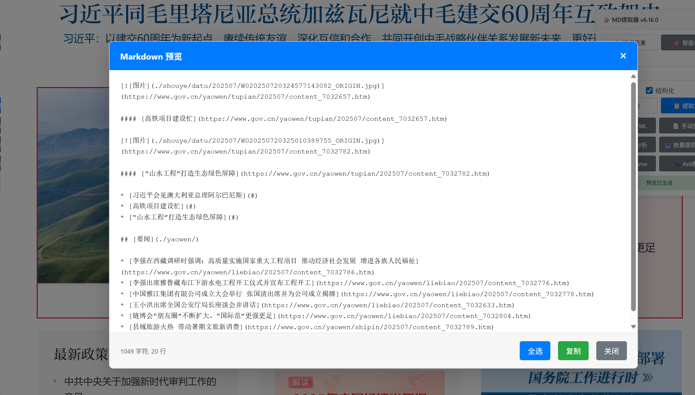

# Agom Markdown提取器

一个强大的Tampermonkey脚本，专为解决网页内容提取和Markdown转换而设计，特别针对iframe跨域内容提取难题。

## 典型应用场景

提取各种网页中的Markdown内容，方便后续扔给AI进行分析。

## 功能特色

### 🚀 突破性iframe内容提取
- **多重提取策略**: 直接访问、消息通信、URL获取
- **智能内容检测**: 自动识别最佳提取方案
- **跨域解决方案**: 突破iframe跨域限制

### 📝 智能Markdown转换
- 自动将HTML内容转换为Markdown格式
- 保持文档结构和格式
- 支持复杂嵌套内容

### 🔍 DOM结构预览
- 实时DOM分析
- 可视化结构展示
- 交互式元素选择

### 👥 用户指导系统
- 直观的操作界面
- 智能提示和引导
- 一键复制功能

## 安装使用

1. 安装 [Tampermonkey](https://www.tampermonkey.net/) 浏览器扩展
2. 点击 [安装脚本](https://github.com/guiyinan/AgomMarkdownExtractor/raw/refs/heads/main/AgomMDextractor.user.js) 或复制脚本内容到Tampermonkey
3. 访问任意网页，脚本将自动加载工具栏
4. 选择内容并使用提取功能

## 使用方法

1. **选择内容**: 在网页上选择需要提取的文本或元素
2. **点击提取**: 使用工具栏上的提取按钮
3. **选择格式**: 选择Markdown或其他格式
4. **复制使用**: 一键复制转换后的内容

## 技术特点

- **跨iframe通信**: 使用postMessage实现跨域通信
- **DOM分析引擎**: 智能识别内容结构
- **多种提取模式**: 适应不同网站架构
- **实时预览**: 即时查看转换效果
- **特别优化** 针对Ant Design/HUI（恒生）做了特别优化

## 兼容性

- ✅ Chrome/Chromium 浏览器
- ✅ Firefox 浏览器
- ✅ Edge 浏览器
- ✅ Safari 浏览器（部分功能）

## 版本信息

当前版本: **v0.9**

## 作者信息

**作者**: Agom Liou  
**微信**: uncleliou

## 支持项目

如果这个脚本对你有帮助，或者让您成功卖班，可以选择将您省下的工作时间的时薪打赏我一些：

## 反馈与贡献

- 遇到问题请提交 [Issue](../../issues)
- 欢迎提交 [Pull Request](../../pulls)
- 建议和反馈请联系作者 agomliou88@gmail.com

